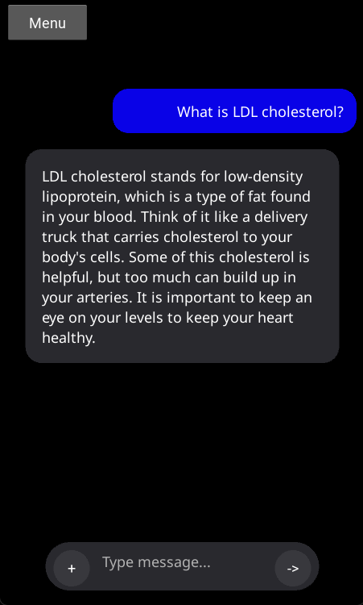

# 🩺 HealthMate

<p align="center">
  
</p>

<p align="center">
  <b>AI-Powered Healthcare Assistant built using Gemma 4, Kivy, and Local AI Processing.</b><br><br>
</p>
<small align="center"><a href="https://www.kaggle.com/competitions/gemma-4-good-hackathon">A submission of The Gemma 4 Good Hackathon</a></small> <br><br>
<p align="center">
  
  
  
  
</p>

---

# 📖 About HealthMate

HealthMate is an AI-powered healthcare assistant that helps users understand medical reports, ask health-related questions, and generate personalized lifestyle guidance using simple and beginner-friendly language.

The app supports:
- Blood Test Reports
- MRI Reports
- CT Scan Reports
- Ultrasound Reports
- PDF Medical Reports
- Medical Images
- Lifestyle Planning
- Health Education

HealthMate uses Gemma 4 multimodal AI locally with intelligent image preprocessing and structured healthcare analysis.

---

# ✨ Features

## 🧠 AI Medical Report Analysis
HealthMate can analyze uploaded medical reports and explain them in simple language.

It can:
- Detect healthy indicators
- Detect indicators needing attention
- Explain complex medical terms
- Provide beginner-friendly summaries
- Highlight possible lifestyle improvements

---

## 🥗 Personalized Lifestyle Planner

HealthMate can generate:
- Workout suggestions
- Diet guidance
- Sleep recommendations
- Hydration advice
- Stress management tips
- Healthy daily habits

---

## 💬 Medical Chat Assistant

Users can ask health-related questions such as:
- “What does LDL cholesterol mean?”
- “How can I improve sleep quality?”
- “What foods help increase hemoglobin?”
- “Is Vitamin D deficiency common?”

---

## 🌍 Multilingual Support

HealthMate automatically responds in the same language as the user whenever possible.

Supported content includes:
- English
- Hindi
- French
- German
- Basic Emojis
- Many more languages using Noto Sans fonts

---

## 🖼️ Multimodal AI Support

HealthMate supports:
- PDFs
- Images
- Scanned reports
- Handwritten prescriptions
- Blood reports
- Medical scans

The app intelligently extracts and processes medical information from uploaded files.

---

# 🏗️ Tech Stack

| Technology | Purpose |
|---|---|
| Python | Backend Logic |
| Kivy | Mobile UI Framework |
| Gemma 4 E2B| AI Model |
| llama-cpp-python | Local LLM Inference |
| OpenCV | Medical Image Processing |
| PyPDF2 | PDF Text Extraction |
| HuggingFace Hub | Model Downloading |

---

# 📂 Project Structure

```bash
HealthMate/
│
├── backend/
│   ├── model.py
│   ├── image_clean.py
│   
│
├── data/
│   └── user_data.json
│
├── assets/
│   ├── HealthMate_logo.png
│   └── NotoSans.ttf
│
├── main.py
├── HealthMate.kv
├── requirements.txt
└── buildozer.spec
```

--- 

# ⚙️ How It Works

## 1️⃣ Upload Reports
Users upload medical reports or images.

---

## 2️⃣ AI Processing

HealthMate:
- extracts report information
- preprocesses medical images
- analyzes findings using Gemma 4

---

## 3️⃣ Structured Response

The AI returns:
- health summaries
- lifestyle recommendations
- simplified explanations
- risk awareness

---

# 🧪 AI Response Types

HealthMate uses structured JSON-based AI outputs.

---

## 💬 Chat Mode

Used for:
- normal questions
- medical education
- follow-up queries

---

## 📄 Report Analysis Mode

Used for:
- medical reports
- scans
- blood tests
- health summaries

---

## 🥗 Lifestyle Planning Mode

Used for:
- workout plans
- healthy diet guidance
- recovery suggestions
- wellness improvement

---

# 📱 Mobile App UI

HealthMate uses:
- Modern dark UI
- Dynamic AI cards
- Professional healthcare color themes
- Mobile-friendly layouts
- Smooth Kivy animations

---

# 🔒 Privacy & Safety

HealthMate is designed with privacy-focused AI processing.

## Important
- The app does NOT replace professional medical advice.
- HealthMate does NOT diagnose diseases.
- HealthMate does NOT prescribe medicines.
- Users should always consult healthcare professionals for medical decisions.

---

# 🚀 Installation

## Clone Repository

```bash
git clone https://github.com/your-username/HealthMate.git
cd HealthMate
```

---

## Install Dependencies

```bash
pip install -r requirements.txt
```

---

## Run Application

```bash
python main.py
```

---

# 🧠 Gemma 4 Integration

HealthMate uses:
- Gemma 4 multimodal capabilities
- Local GGUF inference
- Image understanding
- Structured healthcare responses
- Context-aware report analysis

---

# 📸 Screenshots

Some screenshot of HealthMate:-



---

# 📄 License

This project is licensed under the MIT License.

---

# ⚠️ Disclaimer

HealthMate is an educational AI assistant and is NOT a substitute for professional medical advice, diagnosis, or treatment.

Always consult qualified healthcare professionals for medical concerns.


---

# 👨‍💻 Developer

Developed by [Advay Singh](https://github.com/AdvaySingh-9) & [Kautilya Srivastava](https://github.com/kautilyasrivastava2801)
---

# ⭐ Support

If you like this project:
- Star the repository ⭐
- Fork the project 🍴
- Share feedback 💡
